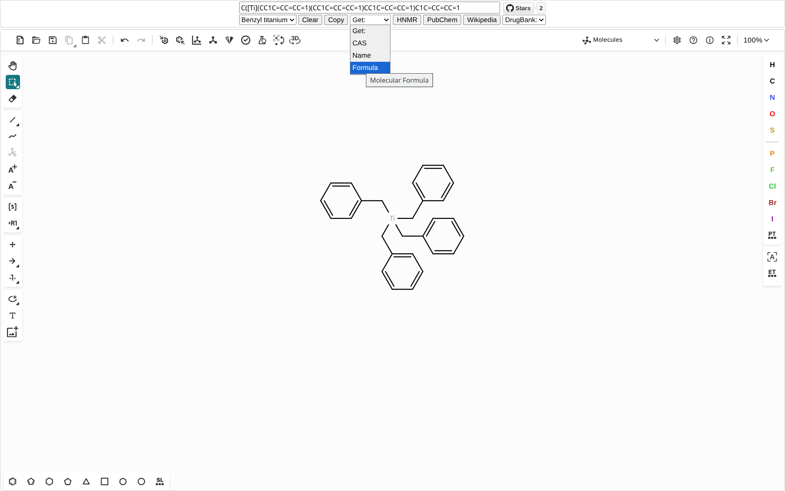

# KetchKekuleSearch

    简体中文 | <a href="README_en.md">English</a>

基于Ketcher和Kekule.js的纯前端实现smiles⇄mol的从分子结构中搜索化合物信息

Powered by [Ketcher](https://github.com/epam/ketcher) & [Kekule.js](https://github.com/partridgejiang/Kekule.js) & [KetchKitSearch](https://github.com/biantailab/KetchKitSearch)

## 依赖

- [pubchem](https://pubchem.ncbi.nlm.nih.gov)
- [nmrdb](https://www.nmrdb.org)

> [!tip]
> DrugBank exact和Wikipedia跳转链接来自PubChem JSON

- [drugbank](https://go.drugbank.com)
- [wikipedia](https://en.wikipedia.org)

## 预览

## 功能

- 实时转换smiles和分子结构
- Example:
    - Benzyl titanium (苄钛)
    - Pregabalin (普瑞巴林)
    - Fluoxetine (氟西汀)
- Clear smiles
- Copy smiles
- Get:
    - CAS
    - IUPACName
    - Molecular Formula (分子式)
- HNMR搜索
- PubChem搜索
- Wikipedia搜索
- DrugBank搜索
    - exact (详细)
    - fuzzy (模糊)

## 更多

- [StructuredSearch](https://github.com/biantailab/StructuredSearch) - 基于Marvin JS和webservices的从分子结构检索化合物信息